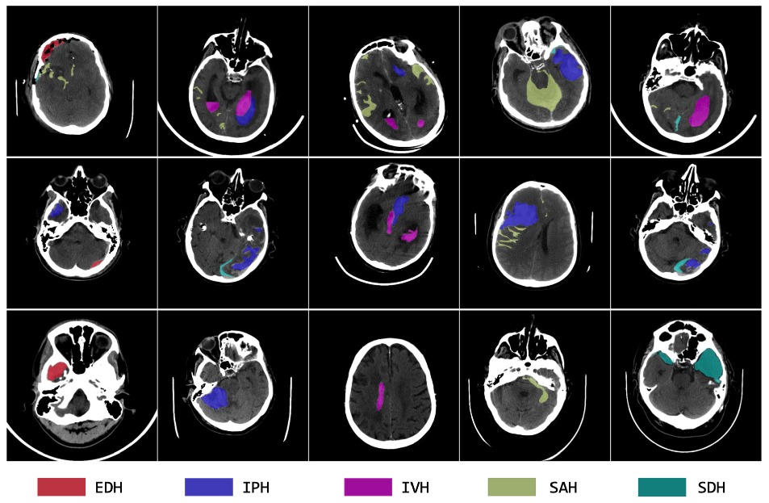

# BHSD: A 3D Multi-class Brain Hemorrhage Segmentation Dataset

Authors: [Biao Wu](https://scholar.google.com/citations?user=Y3SBBWMAAAAJ&hl=en), [Yutong Xie](https://v3alab.github.io/author/yutong-xie/), Zeyu Zhang, Jinchao Ge, [Kaspar Yaxley](https://radiopaedia.org/users/kaspar-lewis-yaxley?lang=us), [Suzan Bahadir](https://au.linkedin.com/in/suzan-bahadir-57870416b), [Qi Wu](http://www.qi-wu.me/), [Yifan Liu](https://scholar.google.com/citations?user=ksQ4JnQAAAAJ&hl=zh-CN), [Minh-Son To](https://www.flinders.edu.au/people/minhson.to)*

*Corresponding author: [minhson.to@flinders.edu.au](minhson.to@flinders.edu.au)
 
[[Paper](https://doi.org/10.1007/978-3-031-45673-2_15)] [[arXiv](https://arxiv.org/abs/2308.11298.pdf)] [[Dataset](https://www.kaggle.com/datasets/stevezeyuzhang/bhsd-dataset)]

Intracranial hemorrhage (ICH) is a pathological condition characterized by bleeding inside the skull or brain, which can be attributed to various factors. 
Identifying, localizing and quantifying ICH has important clinical implications, in a bleed-dependent manner. 
While deep learning techniques are widely used in medical image segmentation and have been applied to the ICH segmentation task, existing public ICH datasets do not support the multi-class segmentation problem. 
To address this, we develop the Brain Hemorrhage Segmentation Dataset (BHSD), which provides a 3D multi-class ICH dataset containing 192 volumes with pixel-level annotations and 2200 volumes with slice-level annotations across five categories of ICH. 
To demonstrate the utility of the dataset, we formulate a series of supervised and semi-supervised ICH segmentation tasks. 
We provide experimental results with state-of-the-art models as reference benchmarks for further model developments and evaluations on this dataset. 





 

## 📚 Datasets 
- Access the datasets used in the paper! [Dataset is publicly available on Kaggle](https://www.kaggle.com/datasets/stevezeyuzhang/bhsd-dataset)


# Contributing to BHSD 🤖🌟

First off, big high fives 🙌 and thank you for considering a contribution to BHSD! Your help and enthusiasm can truly elevate this project. Whether you're fixing bugs 🐛, adding features 🎁, or just providing feedback, every bit matters! Here's a step-by-step guide to make your contribution journey smooth:


## License

BHSD's is under the MIT license. Check out the details [here](LICENSE.md).

## Citation

If you found our work useful in your research, please consider citing our works(s) at:
```
@inproceedings{wu2023bhsd,
  title={BHSD: A 3D Multi-class Brain Hemorrhage Segmentation Dataset},
  author={Wu, Biao and Xie, Yutong and Zhang, Zeyu and Ge, Jinchao and Yaxley, Kaspar and Bahadir, Suzan and Wu, Qi and Liu, Yifan and To, Minh-Son},
  booktitle={International Workshop on Machine Learning in Medical Imaging},
  pages={147--156},
  year={2023},
  organization={Springer}
}
```
